# 作业回顾与思考

*学而不思则罔, 思而不学则殆。--《论语》*

**下面仅记录了我遇到过的问题。正确答案只有一个，但是错误可以千千万万。如有雷同，那恭喜我们是同样的bug。**

## 作业0 & 作业1
  * 没有问题!

## 作业2
> 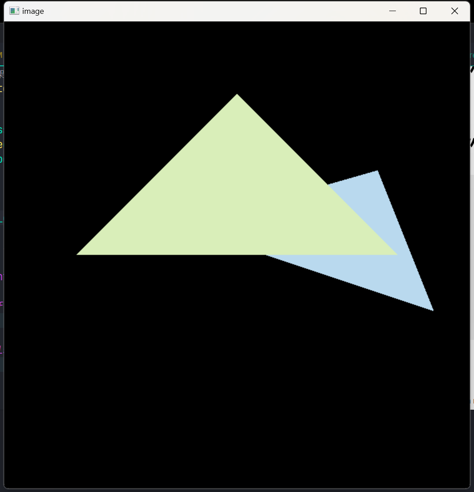&emsp;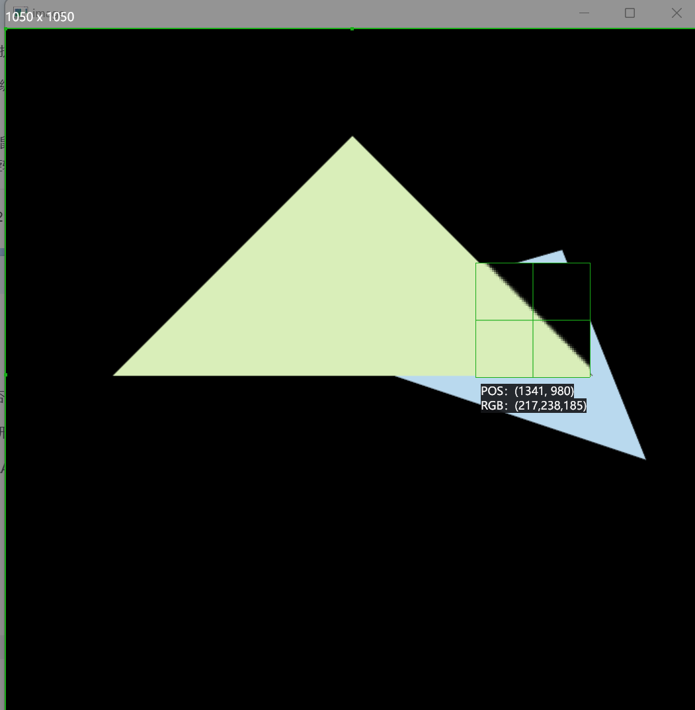&emsp;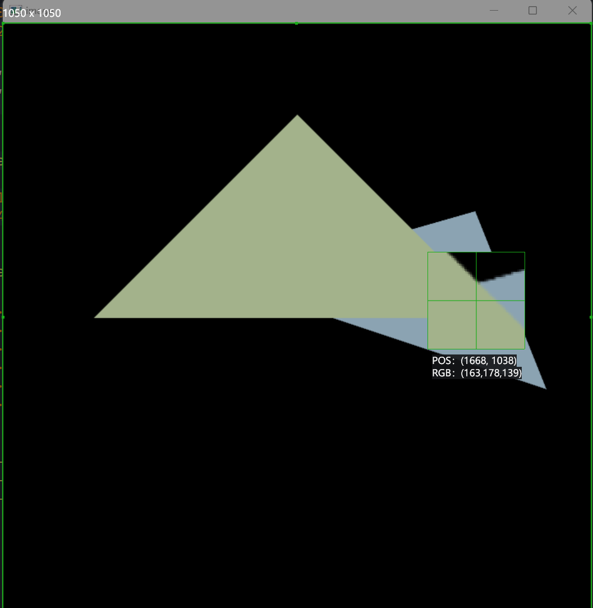<p>
图示: 图1没有使用MSAA,有明显锯齿；图2错误的MSAA，有黑边；图3, MSAA, 锯齿缓解，无黑边。(ps.原图差别明显)


1. 画出来的两个三角形堆叠先后与效果图相反?
   * 深度测试的问题。在作业1中的**get_projection_matrix函数**中深度是**负数**, 负数越小说明越接近屏幕。
   * 在**rasterizer.cpp**中经过viewport transformation后，原本距离屏幕更近点的Z坐标值却越大。
   * 经过转换后的Z值会在**rasterize_triangle函数**中被视作距离，也即距离屏幕越近的点，Z坐标值应越小。至此，效果图中会出现离屏幕越远的点覆盖越近的点的现象。
   * Z值相反，则在**get_projection_matrix**函数中，做一次Z轴对称的变换即可。


2. MSAA有黑边?
    * 黑边形成的原因与具体实现有关。
      * 没有保存次像素的深度和颜色, 图形边界更新像素点的颜色只与靠前的图形颜色相关，并且会取颜色的百分比，边界会暗一些。
      * 保存了次像素的深度和颜色，但是目标像素的**更新方式**有变，主要区别为MSAA更新像素值不用再检查深度, 代码如下：
  ```c++
    auto update_depth_and_color = [this](int x, int y, float test_depth, const Vector3f& color, bool update_color_with_depth_check=true){
        int index = get_index(x, y);
        if(test_depth < depth_buf[index])
        {
            depth_buf[index] = test_depth;
            if(update_color_with_depth_check)
                set_pixel({x * 1.f, y * 1.f, test_depth}, color);
        }
        if(!update_color_with_depth_check)
        {
            set_pixel({x * 1.f, y * 1.f, test_depth}, color);
        }
    };
  ```

  ## 作业3
  > 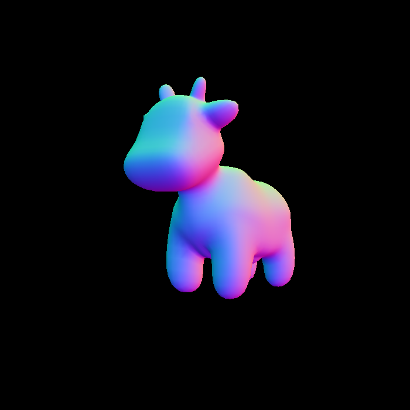&emsp;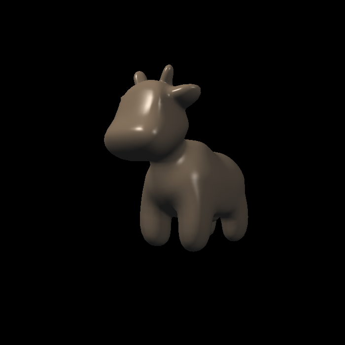&emsp;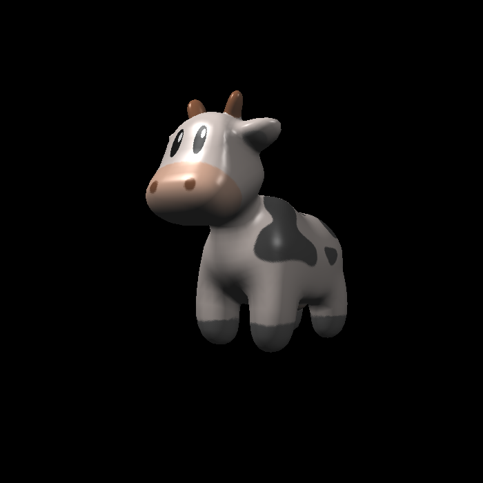&emsp;<p>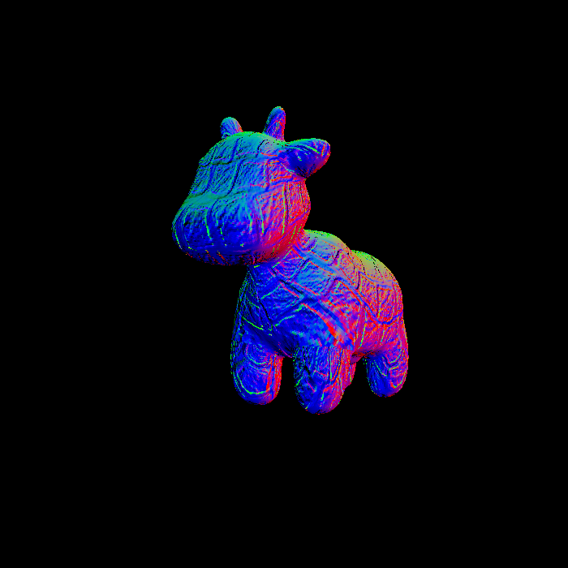&emsp;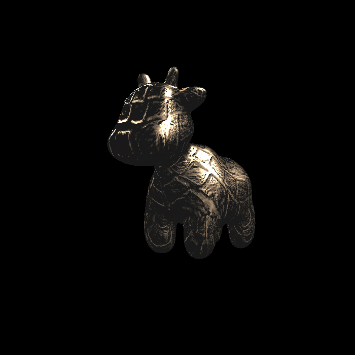<p>
图示: 图1:法线；图2:布林冯光照模型；图3:带纹理的光照模型; 图4:bump纹理; 图5:displacement纹理。

1. Displacement纹理渲染结果与渲染图不同？
  * 遇到的主要问题是渲染出displacement纹理的效果会表面更加粗糙？在原始的实现中，**displacement_fragment_shader**中先计算normal，后更新point的位置。point的更新中，normal也参与计算。而normal通过bump贴图更新值后，相当于对normal做了一次"扰乱"，用更新后的normal去更新point, 则使得模型渲染观感更加"粗糙"。由此，可以推测bump贴图做了两件事:改变顶点的逻辑位置(原本网格中不变)；改变顶点法线。

## 作业4
> 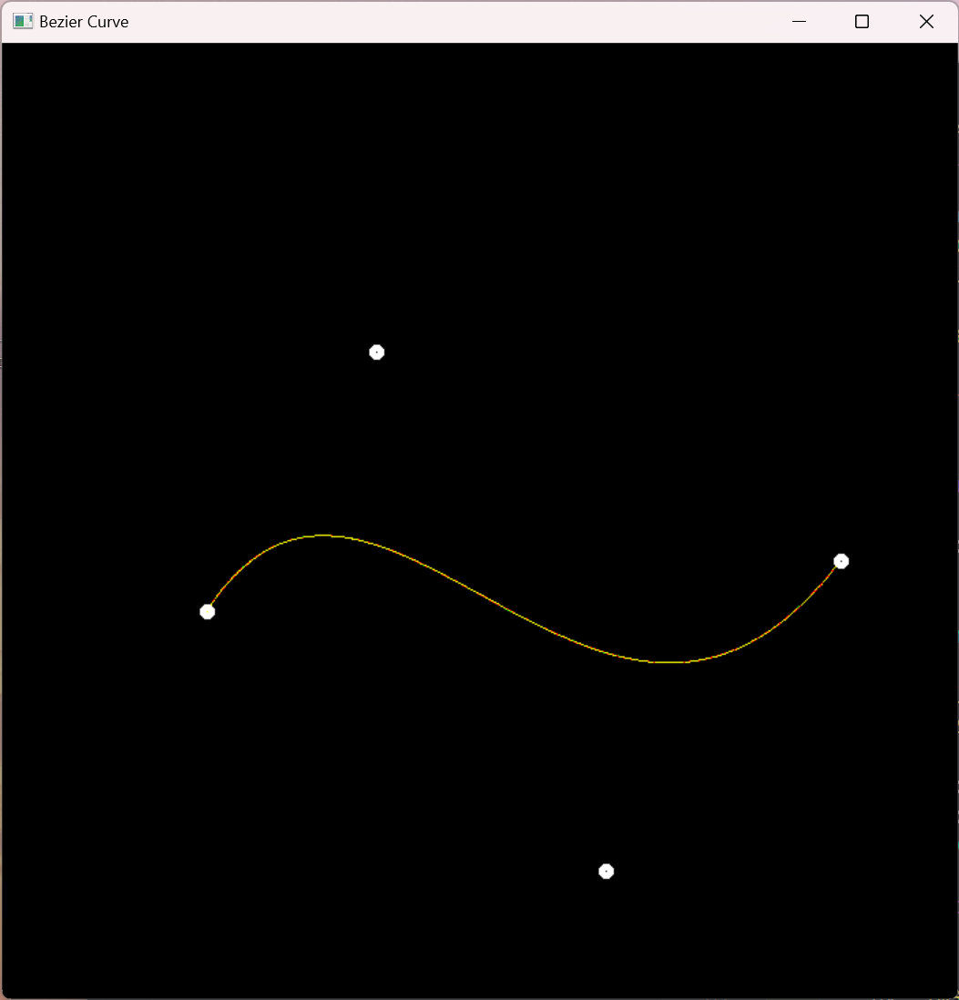&emsp; 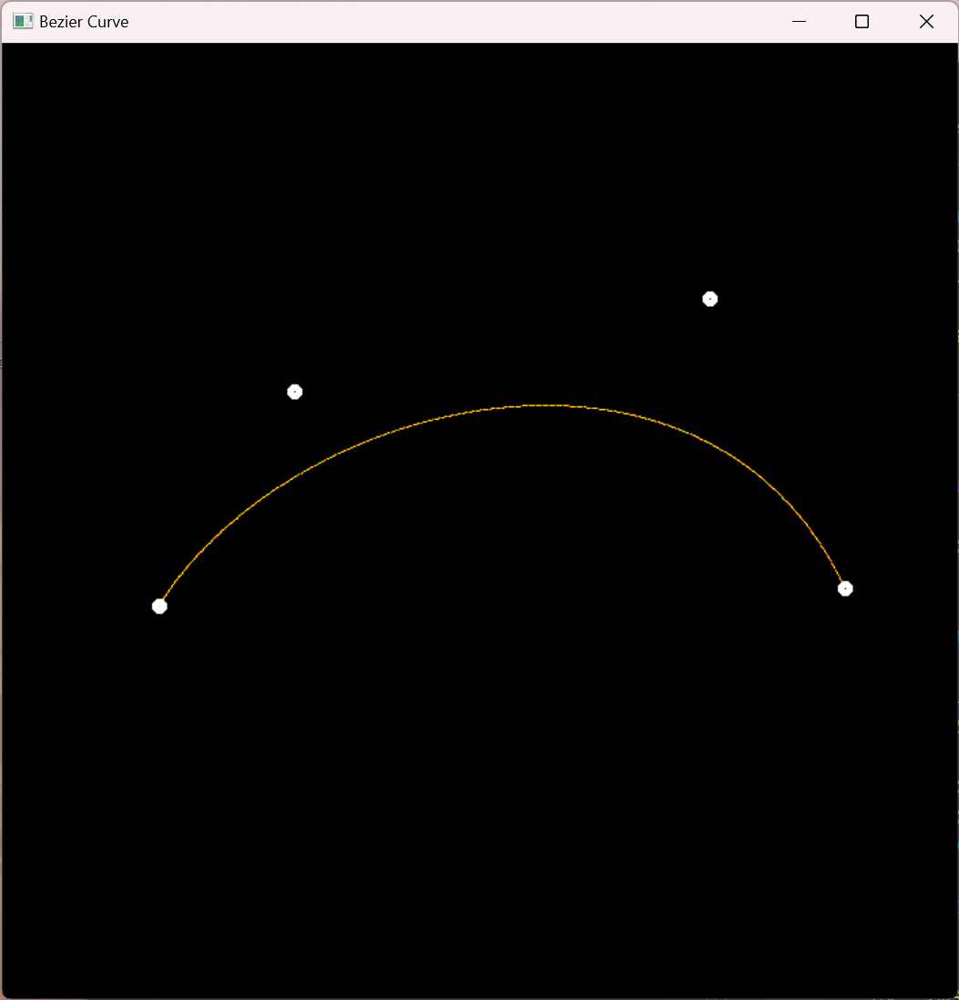&emsp;<p>
图示: 图1: 贝塞尔曲线，图2: 效果不是很好的贝塞尔曲线抗锯齿

1. 如何做贝塞尔曲线的抗锯齿？
* [todo] 尝试了一些办法，但尚未找到一个比较好的方式。

## 作业5
> 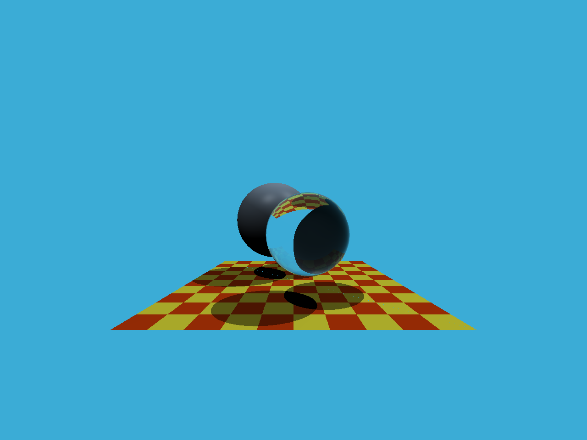&emsp;<p>
图示: 图1: 实验效果图

1. 如何计算世界空间像素点坐标和方向？
* 该节作业的实现关键点在于去理解作业中Render函数中scale的“隐藏含义”：它默认zNear(近平面距离)是1.0f。然后，配合虎书第四章理解世界空间中像素位置x,y(虎书中记为u,v)的计算方法即可。
2. 得知x,y计算方法后，作出结果可能是上下颠倒的？
* 请注意，这里的颠倒造成的原因(我认为)是与framebuffer的使用方式有关，即framebuffer导出的ppm图片的坐标原点在左上角(从左至右，从上至下)，而虎书中假设像素空间的原点在左下角。

