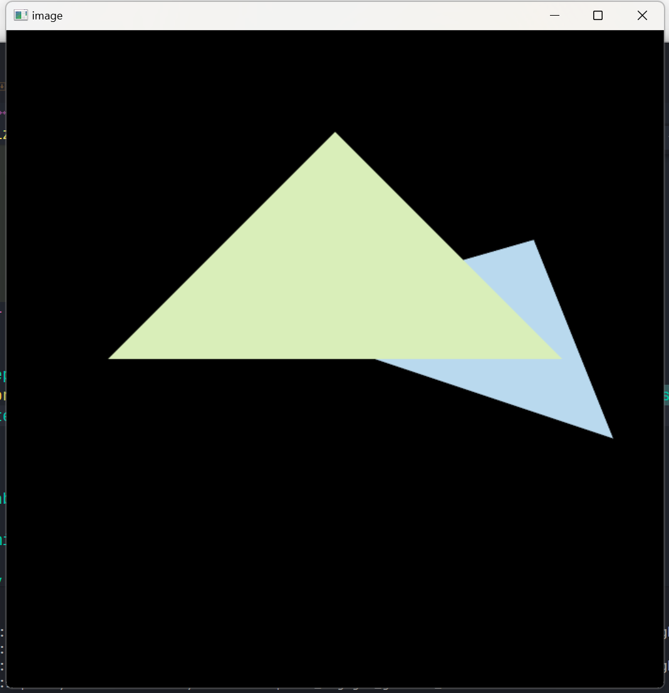
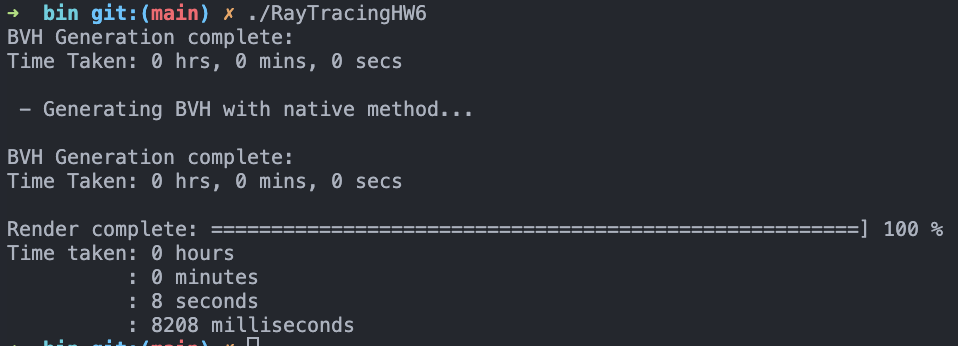

# 作业回顾与思考

*学而不思则罔, 思而不学则殆。--《论语》*

**下面仅记录了我遇到过的问题。正确答案只有一个，但是错误可以千千万万。如有雷同，那恭喜我们是同样的bug。**

## 作业0 & 作业1
  * 没有问题!

## 作业2
> &emsp;&emsp;<p>
图示: 图1没有使用MSAA,有明显锯齿；图2错误的MSAA，有黑边；图3, MSAA, 锯齿缓解，无黑边。(ps.原图差别明显)


1. 画出来的两个三角形堆叠先后与效果图相反?
   * 深度测试的问题。在作业1中的**get_projection_matrix函数**中深度是**负数**, 负数越小说明越接近屏幕。
   * 在**rasterizer.cpp**中经过viewport transformation后，原本距离屏幕更近点的Z坐标值却越大。
   * 经过转换后的Z值会在**rasterize_triangle函数**中被视作距离，也即距离屏幕越近的点，Z坐标值应越小。至此，效果图中会出现离屏幕越远的点覆盖越近的点的现象。
   * Z值相反，则在**get_projection_matrix**函数中，做一次Z轴对称的变换即可。


2. MSAA有黑边?
    * 黑边形成的原因与具体实现有关。
      * 没有保存次像素的深度和颜色, 图形边界更新像素点的颜色只与靠前的图形颜色相关，并且会取颜色的百分比，边界会暗一些。
      * 保存了次像素的深度和颜色，但是目标像素的**更新方式**有变，主要区别为MSAA更新像素值不用再检查深度, 代码如下：
  ```c++
    auto update_depth_and_color = [this](int x, int y, float test_depth, const Vector3f& color, bool update_color_with_depth_check=true){
        int index = get_index(x, y);
        if(test_depth < depth_buf[index])
        {
            depth_buf[index] = test_depth;
            if(update_color_with_depth_check)
                set_pixel({x * 1.f, y * 1.f, test_depth}, color);
        }
        if(!update_color_with_depth_check)
        {
            set_pixel({x * 1.f, y * 1.f, test_depth}, color);
        }
    };
  ```

  ## 作业3
  > &emsp;&emsp;&emsp;<p>&emsp;<p>
图示: 图1:法线；图2:布林冯光照模型；图3:带纹理的光照模型; 图4:bump纹理; 图5:displacement纹理。

1. Displacement纹理渲染结果与渲染图不同？
  * 遇到的主要问题是渲染出displacement纹理的效果会表面更加粗糙？在原始的实现中，**displacement_fragment_shader**中先计算normal，后更新point的位置。point的更新中，normal也参与计算。而normal通过bump贴图更新值后，相当于对normal做了一次"扰乱"，用更新后的normal去更新point, 则使得模型渲染观感更加"粗糙"。由此，可以推测bump贴图做了两件事:改变顶点的逻辑位置(原本网格中不变)；改变顶点法线。

## 作业4
> &emsp; &emsp;<p>
图示: 图1: 贝塞尔曲线，图2: 效果不是很好的贝塞尔曲线抗锯齿

1. 如何做贝塞尔曲线的抗锯齿？
* [todo] 尝试了一些办法，但尚未找到一个比较好的方式。

## 作业5
> &emsp;<p>
图示: 图1: 实验效果图

1. 如何计算世界空间像素点坐标和方向？
* 该节作业的实现关键点在于去理解作业中Render函数中scale的“隐藏含义”：它默认zNear(近平面距离)是1.0f。然后，配合虎书第四章理解世界空间中像素位置x,y(虎书中记为u,v)的计算方法即可。
2. 得知x,y计算方法后，作出结果可能是上下颠倒的？
* 请注意，这里的颠倒造成的原因(我认为)是与framebuffer的使用方式有关，即framebuffer导出的ppm图片的坐标原点在左上角(从左至右，从上至下)，而虎书中假设像素空间的原点在左下角。


## 作业6
> &emsp;<p>
图示: 图1: BVH加速渲染效果图, 图2:BVH运行时间

0. 作业6相对有更多的一些算法涉及，这里顺序列出涉及到的过程和算法。
* 创建一个场景，载入模型，设置灯光
* 设置场景的BVH。
  * [算法1]构造BVH结构
* 遍历所有像素
  * 当前像素生成一条射线ray
  * 求场景与ray的交点
    * [算法2]BVH结构加速求射线与场景中对象的交点
      * [算法3]BoundBox与射线是否有交点
      * [算法4]射线与三角形求交点
  * 求交点处光照模型像素值
* 保存所有像素点处像素，导出成PPM

**算法1**:上述过程中算法1提供的空间结构划分方法是一种类似于“主成分二分法”。笼统地说，进行一次空间分割：获得所有图元三角形“中心”X，Y，Z范围，取取值范围大的轴，将其视为分割主成分，按2分的思想将其分为2个空间分割, 使得两个空间有相同数量的图元三角形。整体上，对完整空间做一次分割，然后对分割出来的2部分递归调用分割算法。

**算法2**: 递归算法，见虎书第12.3.2节介绍

**算法3**: 相对简单，见虎书第12.3.1节介绍

**算法4**:101课程里介绍的Moller Trumbore Alg.

---

1. 能画出效果图，但是耗时大于80s(任意很大的值)？
* 通常BVH实验运行时间应该不会大于10s(特别老的CPU不能保证)。效果图能出说明射线求交等部分没有问题，问题可能出在递归BVH求交点的部分, 即**BVHAccel::getIntersection**函数。如果耗时非常大，说明BVH并没有起到加速作用，注意排查递归出口。下面是我犯的低级错误😭, 发现问题了吗？
```c++
Intersection BVHAccel::getIntersection(BVHBuildNode *node,
                                       const Ray &ray) const {
  // TODO Traverse the BVH to find intersection

  // recursive exit。
  // error: use root node to check ray&BoundingBox Intersection. BVH does't work in fact.
  // please using "node" to instead "root".
  if (node == nullptr || !root->bounds.IntersectP(ray, ray.direction_inv,
                                                  {int(ray.direction.x < 0),
                                                   int(ray.direction.y < 0),
                                                   int(ray.direction.z < 0)}))
    return {};

  // leave node ray&object intersection check
  if (node->left == nullptr && node->right == nullptr) {
    return node->object->getIntersection(ray);
  }

  // recursive part
  auto left_inter = getIntersection(node->left, ray);
  auto right_inter = getIntersection(node->right, ray);
  return left_inter.distance < right_inter.distance ? left_inter : right_inter;
```


